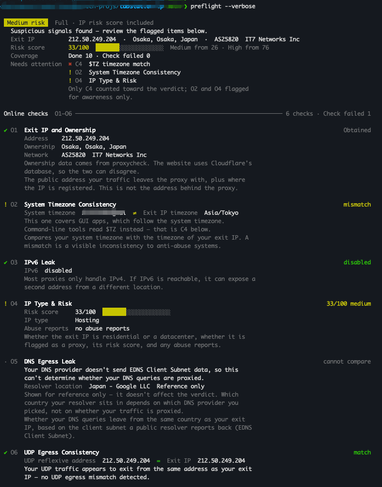
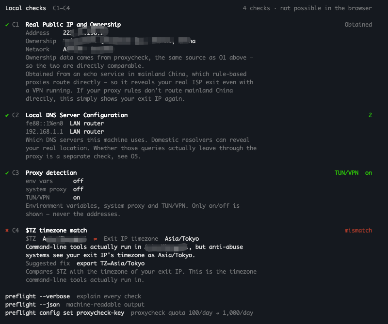

# Preflight

面向「对 IP 网络环境敏感的工具」用户的网络环境体检——用之前先确认自己的 IP 环境。一个仓库产出两个实现，共享同一份[判级契约](docs/verdict.md)：

- **Preflight Web** —— 在线体检站，零门槛，能测 6 项
- **Preflight CLI** —— 本机命令行工具，覆盖全部 10 项

按 IP 判断访客的工具与服务对访问环境很敏感，网络环境配置至关重要：IPv6 悄悄泄露真实地址、DNS 走国内服务商暴露位置、出口 IP 风险过高触发风控、系统时区与出口 IP 对不上……开跑之前先扫一眼。

## 长什么样

`preflight --verbose` 在一台开着代理的机器上跑出来的完整输出。结论在最上面——档位、出口 IP、风险分、覆盖度，以及需要注意的几项：



往下是本机检测 C1–C4，网页结构性拿不到的就是这四项，也是装 CLI 的理由：



不带 `--verbose` 只留结论与每项的取值，没有这些解释段落。截图里的真实 IP 与系统时区已打码。

## 安装 CLI

**macOS / Linux**

```bash
curl --proto '=https' --tlsv1.2 -LsSf https://github.com/changyetech/preflight/releases/latest/download/preflight-installer.sh | sh
```

**Windows（PowerShell）**

```powershell
powershell -c "irm https://github.com/changyetech/preflight/releases/latest/download/preflight-installer.ps1 | iex"
```

**从源码**——有 Rust 工具链（1.90+）的话：

```bash
cargo install --git https://github.com/changyetech/preflight
```

**不发布到 crates.io。** 也可以直接从 [Releases](https://github.com/changyetech/preflight/releases) 下对应平台的压缩包，解开把 `preflight` 丢进 `PATH`。预编译二进制覆盖 macOS（Apple Silicon + Intel）、Linux（x86_64 + arm64）与 Windows（x86_64）。

**升级用 `preflight update`**——有新版才下载，复用官方 installer；把上面的安装命令再跑一遍效果相同（源码安装的没有 install receipt，`update` 会拒绝，请重新构建替换）。**没有 Homebrew 通道**——那需要一个独立的 tap 仓库（Homebrew 的命名硬规则，formula 不能住在主仓库里），目前不值这个维护面。

**卸载**用 `preflight uninstall`（删二进制与 install receipt，配置保留）；`preflight uninstall --purge` 连配置目录一起删。

## 使用

```bash
preflight                 # 体检
preflight --verbose       # 附带每一项的说明
preflight --json          # 机器可读输出
preflight --lang en       # en / zh-hans
```

可选：注册一个免费的 proxycheck key，把日配额从 100 次提到 1000 次。

```bash
preflight config set proxycheck-key    # 交互式输入，不回显、不进 shell history
```

其他可配置项（`config list` 看生效值，`config unset <键>` 恢复默认）：

```bash
preflight config set language zh-hans  # en / zh-hans
preflight config set timeout 20        # 网络探测超时，1–120 秒
preflight config set no-color true     # 关闭彩色输出
```

## 10 个检测项

| ID | 检测项 | Web | CLI |
|---|---|---|---|
| O1 | 出口 IP 与归属 | ✅ | ✅ |
| O2 | 系统时区一致性（对应图形界面应用） | ✅ | ✅ |
| O3 | IPv6 泄露 | ✅ | ✅ |
| O4 | IP 类型与风险 | 按需 | 自动 |
| O5 | DNS 出口泄露（DNS 查询是不是与出口 IP 从同一处出网） | ✅ | ✅ |
| O6 | UDP 出口一致性（UDP 的出口是不是与 TCP 观测到的出口 IP 一致） | ✅ | ✅ |
| C1 | 本机真实 IP（国内直连回显） | — | ✅ |
| C2 | 本地 DNS 服务器配置 | — | ✅ |
| C3 | 代理检测（环境变量 / 系统代理 / TUN） | — | ✅ |
| C4 | `$TZ` 时区一致性（命令行工具认的那个） | — | ✅ |

C1–C4 必须读取本机环境，网页结构性拿不到——这不是网页版偷懒，是能力边界（[ADR-0001](docs/adr/0001-web-as-cli-frontend-not-replacement.md)）。

**两端的结论在少数情形下会不同**，而且是刻意的：网页读不到 `$TZ`、读不到 TUN 状态，归属数据也来自不同的地理库。差异逐条登记在[判级契约第 5 节](docs/verdict.md)，不是 bug。

## 隐私

- **不存储任何检测结果**，两端都没有数据库、没有用户态（[ADR-0008](docs/adr/0008-privacy-informed-consent-upfront.md)）
- CLI **直连**第三方，不经过本站服务器——你的查询不会消耗网页版的共享配额，反过来也一样（[ADR-0012](docs/adr/0012-cli-direct-third-party-not-worker-api.md)）
- proxycheck key 只存在于你本机的配置文件（权限 `600`），绝不出现在输出、日志或任何请求之外的地方
- 代理检测只显示**开关状态**，不显示地址

## 开发

```bash
make help          # 全部 target
make check         # Web：fmt + lint + build + test
make check-cli     # CLI：fmt + clippy + build + test
make check-all     # 两边都跑
```

Web 是 React 19 + Vite + Cloudflare Worker，CLI 是 Rust。两端共享 `docs/verdict.md` 与 `docs/verdict-cases.json`——判级规则改一处，两边的 CI 同时变红。

**配置**（环境变量、Worker Secret、GitHub Secrets、CI）见 **[docs/configuration.md](docs/configuration.md)**；**部署与发版**（Cloudflare 上线、回滚、打 `cli/v*` tag 发 CLI）见 **[docs/deployment.md](docs/deployment.md)**。

约定与架构见 [CLAUDE.md](CLAUDE.md)，术语见 [CONTEXT.md](CONTEXT.md)。

**本仓库只有 CLI 发 Release**（Web 走 Cloudflare 部署），否则安装命令里的 `releases/latest` 会被串掉。

## 前身

CLI 的前身是 Python 写的 `ai-ipcheck`，已归档、不再维护。Rust 版相对它有三处刻意的行为变更，理由见 [ADR-0010](docs/adr/0010-verdict-contract-normative-cli-full-implementation.md) 与
[实现计划](docs/plans/2026-08-12-cli-rust-rewrite--output.md)（其中的端点检测一项已按 [ADR-0013](docs/adr/0013-drop-vendor-endpoint-check.md) 整项移除）。

## License

MIT
